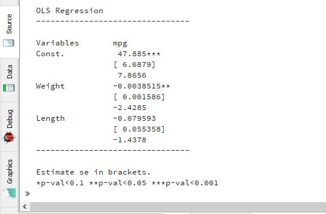
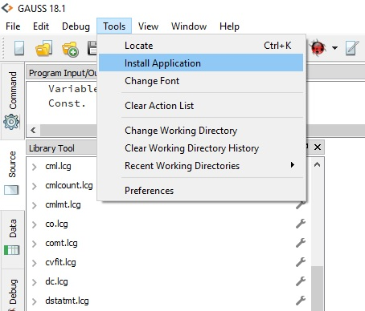
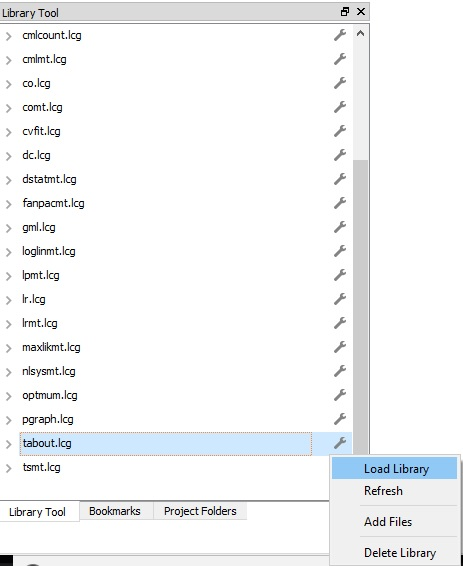

# GAUSS Table Creator
This package provides tools for creating and exporting publication-quality tables in GAUSS. The modern `pubtable` API is designed for coefficient tables, model comparison tables, summary/statistics tables, and custom matrix/data tables.

Legacy `tableControl` and `tableSet` files are retained for migration experiments, but new work should use the `pubtable` API.

## Modern `pubtable` API

The package now includes an early `pubtable` API for GAUSS-first publication tables. It keeps table construction, formatting, and export separate, and includes convenience adapters for common GAUSS output structures.

```gauss
new;
library pubtable;

struct olsmtControl ctl;
struct olsmtOut out;

ctl = olsmtControlCreate;
ctl.output = 0;

out = olsmt(ctl, getGAUSSHome() $+ "examples/auto.dat", "mpg ~ weight + length");

struct ptTable tbl;
tbl = ptTableFrom(out);
tbl = ptSetTitle(tbl, "OLS Regression");

call ptExport(tbl, "ols_table.md");
call ptExport(tbl, "ols_table.tex");
call ptExport(tbl, "ols_table.xlsx");
call ptExport(tbl, "ols_table.rtf");
```

Supported table sources in this first version:

| Function | Use |
| --- | --- |
| [`ptTableFromMatrix(x, rowNames, colNames, title)`](docs/api/ptTableFromMatrix.md) | Custom matrix tables. |
| [`ptTableFrom(out)`](docs/api/ptTableFrom.md) | Automatic dispatch using `isStructType`. |
| [`ptModelFrom(name, out)`](docs/api/ptModelFrom.md) | Typed model adapters. |
| [`ptModelCompare(models)`](docs/api/ptModelCompare.md) | Side-by-side model comparison, aligning on the union of term and goodness-of-fit row names across models with different regressors. |

Coefficient tables show one statistic row per term (standard errors by default). Use `ptModelSetStatRows(model, statRows)` (or `ptSetStatRows(tbl, statRows)`) to choose any combination of `"se"`, `"tstat"`, `"pvalue"`, and `"ci"`; confidence intervals require calling `ptModelSetCI(model, ciLower, ciUpper)` first.

Significance stars use the default cutoffs `0.10`/`0.05`/`0.01` with symbols `"+"`/`"*"`/`"**"`. Use `ptModelSetStars(model, cutoffs, symbols)` (or `ptSetStars(tbl, cutoffs, symbols)`) for custom thresholds/symbols, and `ptModelNoStars(model)` (or `ptNoStars(tbl)`) to disable stars entirely.

### Style presets

`ptModelApplyPreset(model, preset)` / `ptApplyPreset(tbl, preset)` apply a bundle of `ptFormat` settings in one call:

| Preset | Settings |
| --- | --- |
| `"journal"` | 3 digits, default significance stars, one `"se"` row, parenthesized statistics (the default settings). |
| `"compact"` | 2 digits, default significance stars, one `"se"` row, parenthesized statistics. |
| `"plain"` | 3 digits, no significance stars, one `"se"` row, no statistic wrapper. |
| `"report"` | 3 digits, default significance stars, `"se"` and `"pvalue"` rows, parenthesized statistics. |

Apply a preset before calling `ptModelTable`/`ptExport` so the chosen formatting is used when the table is rendered.

For more control over model comparisons, build a `ptCompareOptions` struct with `ptCompareOptionsCreate()` and pass it to `ptModelCompareWith(models, opts)`:

| Function | Behavior |
| --- | --- |
| `ptCompareSetTermOrder(opts, termOrder)` | Puts the listed terms first, in that order, with any remaining terms appended afterward. |
| `ptCompareSetGofOrder(opts, gofOrder)` | Does the same for goodness-of-fit rows. |
| `ptCompareSetLabelMap(opts, mapFrom, mapTo)` | Renames term row labels for display (e.g. `"Constant"` to `"(Intercept)"`) without affecting how terms are matched across models. |
| `ptCompareSetNotes(opts, notes)` | Adds table-level notes. Per-model notes set with `ptModelSetNotes(model, notes)` are also included, prefixed with the model name when comparing more than one model. |
| `ptCompareSetColGroups(opts, colGroups)` | Adds a grouped/spanning header above the comparison columns, one label per model (e.g. to group columns by equation, quantile, or panel). |

`ptModelCompare(models)` is shorthand for `ptModelCompareWith(models, ptCompareOptionsCreate())`.

### Grouped / spanning column headers

`ptSetColGroups(tbl, colGroups)` sets one column-group label per body column (use `""` for ungrouped columns). Contiguous columns with the same label are rendered as a single spanning header:

```gauss
tbl = ptSetColGroups(tbl, "Sample A" $| "Sample A" $| "Sample B" $| "Sample B");
```

Markdown, CSV, and plain text render a pseudo-span (the label appears in the first column of the run, with blanks for the remaining spanned columns); LaTeX renders `\multicolumn{n}{c}{...}` with a `\cmidrule(lr){...}` underneath; HTML renders `<th colspan="n">`; RTF renders merged header cells via `\clmgf`/`\clmrg`.

### Column alignment everywhere

`ptSetColAlign(tbl, colAlign)` / `ptModelSetColAlign(model, colAlign)` previously only affected LaTeX output. The same `colAlign` string (one `l`/`c`/`r` per column, including the stub column) now also controls:

| Format | Behavior |
| --- | --- |
| Markdown | Emits a matching alignment row (`:---`, `:---:`, `---:`). |
| HTML | Adds `style="text-align:..."` with left, center, or right alignment to header and data cells. |
| Plain text | Left/center/right-pads each column. |

Leaving `colAlign` unset keeps the previous defaults: the stub column left-aligned and data columns right-aligned.

### Number formatting and cell styling

`ptSetColFormat(tbl, colDigits)` re-formats the body cells of one or more columns to a chosen number of decimal digits (one entry per body column, `""` to leave a column unchanged):

```gauss
tbl = ptSetColFormat(tbl, "0" $| "2");
```

It re-parses each already-rendered numeric cell with `strtof` and reformats it with `ptFormatNumber`, so it works on plain numeric tables but not on cells already wrapped with significance stars or statistic parentheses.

`ptSetCellStyle(tbl, row, col, style)` marks an individual body cell (1-based row/col) as `"bold"`, `"italic"`, `"bold italic"`, or `""`:

```gauss
tbl = ptSetCellStyle(tbl, 1, 2, "bold");
```

Markdown, LaTeX, HTML, and RTF renderers apply the styling (`**bold**`, `\textbf{...}`, `<strong>...</strong>`, `\b ... \b0`); CSV and plain text renderers ignore cell styling since those formats can't represent it.

### Exporting multiple tables to one file

`ptExportAll(tables, fname)` writes an array of `ptTable` structs (e.g. `reshape(tbl, n, 1)` with indexed assignment) to a single file, dispatching on extension like `ptExport`:

| Format | Behavior |
| --- | --- |
| Markdown/CSV/plain text/HTML | Each table's rendered output is concatenated (Markdown tables are separated by a horizontal rule). |
| RTF | All tables are merged into a single `{\rtf1...}` document. |
| XLS/XLSX | Each table is written to its own sheet (sheet `1`, `2`, ... via `SpreadsheetWrite`). |

### Batch reporting in multiple formats

`ptExportAllFormats(tables, basename, exts)` builds on `ptExportAll` to produce a full report in several formats with one call:

```gauss
call ptExportAllFormats(tables, "results/report", "md" $| "tex" $| "html" $| "xlsx");
```

This writes `results/report.md`, `results/report.tex`, `results/report.html`, and `results/report.xlsx`, each via `ptExportAll`. It returns `0` if every format exported successfully, otherwise the return code of the first format that failed (the remaining formats are still attempted).

Initial automatic adapters:

| Output struct | Adapter |
| --- | --- |
| `olsmtOut` | Automatic |
| `glmOut` | Automatic |
| `gmmOut` | Through [`ptModelFrom`](docs/api/ptModelFrom.md) |
| `dstatmtOut` | Automatic |
| `fglsOut` | Automatic |

### Auto-loading optional adapters

Adapters for optional GAUSS packages (cmlmt, maxlikmt, optmt, tsmt) are auto-detected. The first time `pubtable.src` is loaded on an installed package, it silently checks which optional libraries are present and writes `pubtable_config.sdf` with the appropriate `#define` entries. No explicit call to `ptSetup()` is needed for installed packages.

To activate the adapters, include the generated config before `pubtable.src` in your programs:

```gauss
library pubtable;
library cmlmt;
#include cmlmt.sdf
#include pubtable_config.sdf   /* generated automatically on first load */
#include pubtable.sdf
#include pubtable.src          /* cmlmt adapter loads because PT_USE_CMLMT is defined */
```

For development installations (git clones not installed via the package manager), run `ptSetupAt` once with the path to the `src/` directory:

```gauss
call ptSetupAt("C:/path/to/gauss_table_creator/src/");
```

To force re-detection after installing a new optional library, call `ptSetup()`:

```gauss
call ptSetup();
```

qardl is auto-detected via the `QARDL_SDF_INCLUDED` guard in `qardl.sdf` — just include `qardl.sdf` before `pubtable.src`; no config entry needed.

Optional add-on package adapters (not wired into `ptModelFrom`/`ptTableFrom`, since they require packages that may not be installed):

| Package/results | Adapters and requirements |
| --- | --- |
| `maxlikmtResults` | `ptModelFromMaxlikmt`/`ptFromMaxlikmt` in `src/pubtable_maxlikmt.src`. Requires `library maxlikmt;` and `#include maxlikmt.sdf` before including this file. |
| `cmlmtResults` | `ptModelFromCmlmt`/`ptFromCmlmt` in `src/pubtable_cmlmt.src`. Requires `library cmlmt;` and `#include cmlmt.sdf` before including this file. |
| tsmt (Time Series MT) results | `src/pubtable_tsmt.src` provides `ptModelFromArimamt`/`ptFromArimamt` (`arimamtOut`), `ptModelFromTsPanel`/`ptFromTsPanel` (`tsPanelEstimationOut`), `ptModelFromAutomt`/`ptFromAutomt` (`automtOut`), `ptModelFromVarmamt`/`ptFromVarmamt` (`varmamtOut`), `ptModelFromLsdvmt`/`ptFromLsdvmt` (`lsdvmtOut`), `ptModelFromSwitchmt`/`ptFromSwitchmt` (`switchmtOut`), `ptModelFromGarchmt`/`ptFromGarchmt` (`garchEstimation`), and `ptFromTscsmt` (`tscsmtOut`, a [`ptModelCompare`](docs/api/ptModelCompare.md) table comparing the within/fixed-effects and error-components estimates). Requires `library tsmt;` and `#include tsmt.sdf` before including this file; `tsPanelEstimationOut` adapters also require `#include tspanel.src` from the tsmt package. Several output structs (`automtOut`, `lsdvmtOut`, `tscsmtOut`) don't carry the original variable names, so those adapters use generic `X`/`AR`/`x` row labels. |
| `optmtResults` | `ptTableFromOptmt` in `src/pubtable_optmt.src` builds a parameter/estimate/gradient table (no standard errors, since `optmtResults` has no covariance matrix). Requires `library optmt;` and `#include optmt.sdf` before including this file. |
| QARDL package (ARDL/QARDL/NARDL/CS-ARDL family) | `src/pubtable_qardl.src` provides `ptModelFromArdl`/`ptFromArdl` (`ardlOut`), `ptModelFromArdlECM`/`ptFromArdlECM` (`ardlECMOut`), `ptModelFromQardl`/`ptFromQardl` and `ptModelFromQardlECM`/`ptFromQardlECM` (`qardlOut`/`qardlECMOut`, one comparison column per quantile in `out.tau`), `ptModelFromNardl`/`ptFromNardl` and `ptModelFromNardlECM`/`ptFromNardlECM` (`nardlOut`/`nardlECMOut`), `ptModelFromCsardl`/`ptFromCsardl` and `ptModelFromCsardlECM`/`ptFromCsardlECM` (`csardlOut`/`csardlECMOut`), `ptFromArdlFull` (`ardlFullOut`) and `ptTablesFromQardlFull`/`ptTablesFromNardlFull`/`ptTablesFromCsardlFull` (`qardlFullOut`/`nardlFullOut`/`csardlFullOut`, each returning a 2x1 `ptTable` array of levels + ECM tables for `ptExportAll`), and the `ptFromArdlFamily` dispatcher. Requires `library qardl;` and `#include qardl.sdf` before including this file. |

Initial exporters:

| Exporter | Extensions and notes |
| --- | --- |
| Markdown | `.md` |
| LaTeX | `.tex` |
| CSV | `.csv` |
| Plain text | `.txt` |
| Excel | `.xls` through GAUSS `SpreadsheetWrite`; `.xlsx` is attempted through the same route where supported by the local GAUSS/Excel stack. |
| Word-compatible rich text | `.rtf` (rendered as a real RTF table with borders and a bold header row, not just tab-separated text). |
| HTML | `.html`/`.htm` |

True `.docx` export is not part of the first version because it requires generating zipped Office Open XML. The practical Word path for now is `.rtf`/`.html`, with true `.docx` a candidate for a later exporter phase.

### LaTeX options

`ptRenderLatex` (and `ptExport(tbl, "*.tex")`) support a few additional `ptFormat` options:

| Option | Behavior |
| --- | --- |
| `ptSetLabel(tbl, "tab:my-table")` / `ptModelSetLabel(mdl, "tab:my-table")` | Adds a `\label{...}` after `\caption{...}`. |
| `ptSetColAlign(tbl, "lcr")` / `ptModelSetColAlign(mdl, "lcr")` | Overrides the default column alignment (`l` for the stub column, `r` for data columns). The string must contain one `l`/`c`/`r` character per column, including the stub column. |

## Getting Started
### Prerequisites
The program files require a working copy of **GAUSS**. The modern `pubtable` API is currently tested with GAUSS 26.

### Installing
**GAUSS 20+**
The package can be installed and updated directly in GAUSS using the [GAUSS package manager](https://www.aptech.com/blog/gauss-package-manager-basics/) once packaged as `pubtable`.

**GAUSS 18+**
Older application-wizard installation is retained as a provisional legacy workflow. If packaging this repository manually, use the `pubtable` manifest and source files:

1. Zip the package as `pubtable.zip`.
2. Select **Tools > Install Application** from the main GAUSS menu.

3. Follow the installer prompts, making sure to navigate to the downloaded `pubtable.zip`.
4. Before using the package, load the `pubtable` library:

| Method | Action |
| --- | --- |
| Library tool view | Navigate to the library tool view window and click the small wrench located next to the `pubtable` library. Select `Load Library`. |
| Program input/output window | Enter `library pubtable`. |
| Program files | Put the line `library pubtable;` at the beginning of your program files. |

  

Note: this installation section is provisional while the package is being modernized.

### Examples
Modern examples are in `examples/model_table_ols.e`, `examples/model_comparison.e`, `examples/summary_table.e`, `examples/summary_statistics_dstatmt.e`, and `examples/export_formats.e`. Older `tableSet*.e` examples are retained as legacy references.

### Further documentation

| Document | Description |
| --- | --- |
| [docs/README.md](docs/README.md) | Documentation index, including a command reference for the modern API in `docs/api/`. |
| [docs/migration.md](docs/migration.md) | Mapping from the legacy `tableControl`/`tableSet...`/`outputTable` workflow to the modern `pt*` API. |

## Authors

| Author | Affiliation |
| --- | --- |
| Eric Clower | [IMPLAN](www.aptech.com) |
